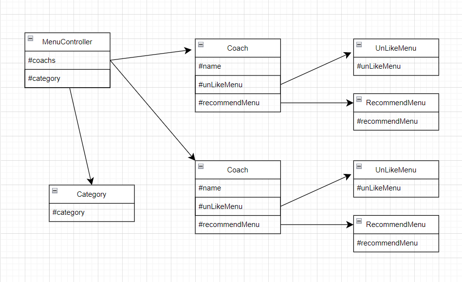

## 🔧 기능 목록

- [x] 카테고리 무작위 추천 기능
  - [x] 주 2회 이상 동일 카테고리 중복되는지 체크
- [x] 코치 이름 입력 기능
  - [x] 코치 인스턴스 생성
- [x] 못먹는 메뉴 입력 기능
- [x] 메뉴 추천 기능
  - [x] 메뉴 중복 체크
- [x] 추천된 메뉴 출력 기능

 

## ❗예외 사항 (오류 발생 사항)

- 코치 이름 입력
  - 코치 이름의 길이가 2 - 4 범위를 벗어날 경우
  - 코치가 2 - 5명의 범위를 벗어날 경우
- 못 먹는 메뉴 입력
  - 못 먹는 메뉴가 3개 이상일 경우 (2개까지만 허용)
  - 못 먹는 메뉴가 주어진 메뉴에 포함되어 있지 않은 경우

 

## ✅ 관계도

- 프로그램 실행 초기에 카테고리 생성 함수를 호출하여 `Category` 인스턴스를 생성한 후 저장한다.
- 각 코치는 `recommendMenu`, `UnLikeMenu` 인스턴스를 저장할 `#recommendMenu`, `#unLikeMenu` 필드를 가진다.
- 입력값이 발생하면 `UnLikeMenu` 인스턴스를 생성하여 각 코치가 못 먹는 메뉴를 저장한다.
- `MenuController`가 메뉴 추천 함수를 호출하면 `Category` 인스턴스 속 `#category`와 각 코치의 `UnLikeMenu` 인스턴스 속 `#unLikeMenu`를 참조하여 각 코치에게 적절한 `recommendMenu` 인스턴스를 생성한 후 저장한다.
- (view는 공간이 좁아서 못그렸습니다 ㅠㅠ)
